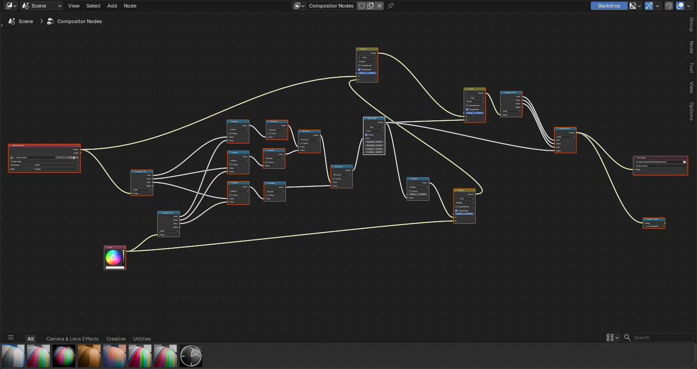

From https://stackoverflow.com/a/62334218

Useful to export baked shadows, with non shadowed part being transparent, to blend with the environment.

I added a mapping to clamp almost-white pixels to an alpha of zero, and linearly remap the other pixels values.

