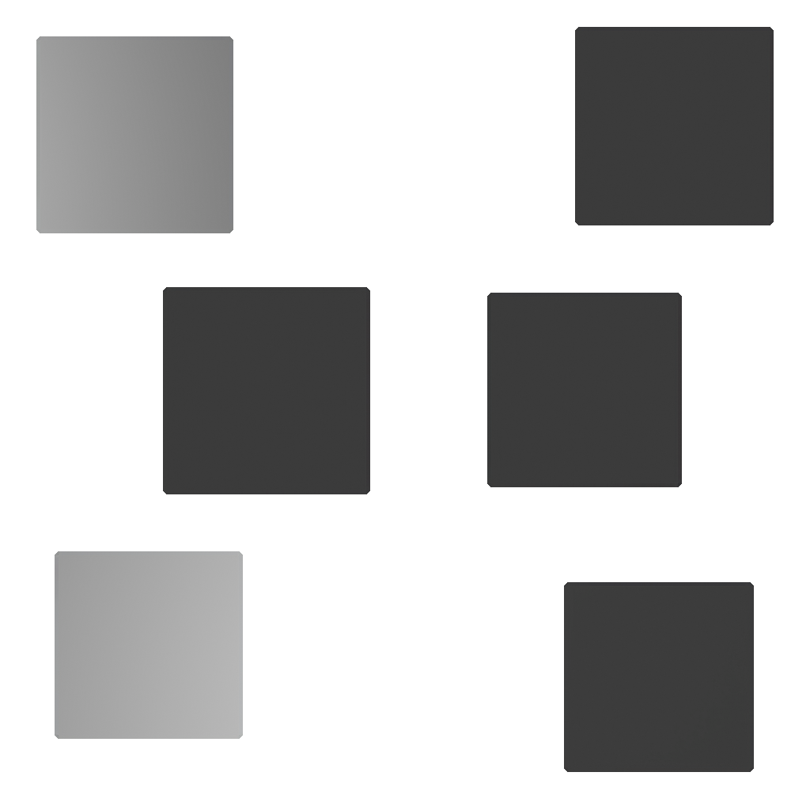
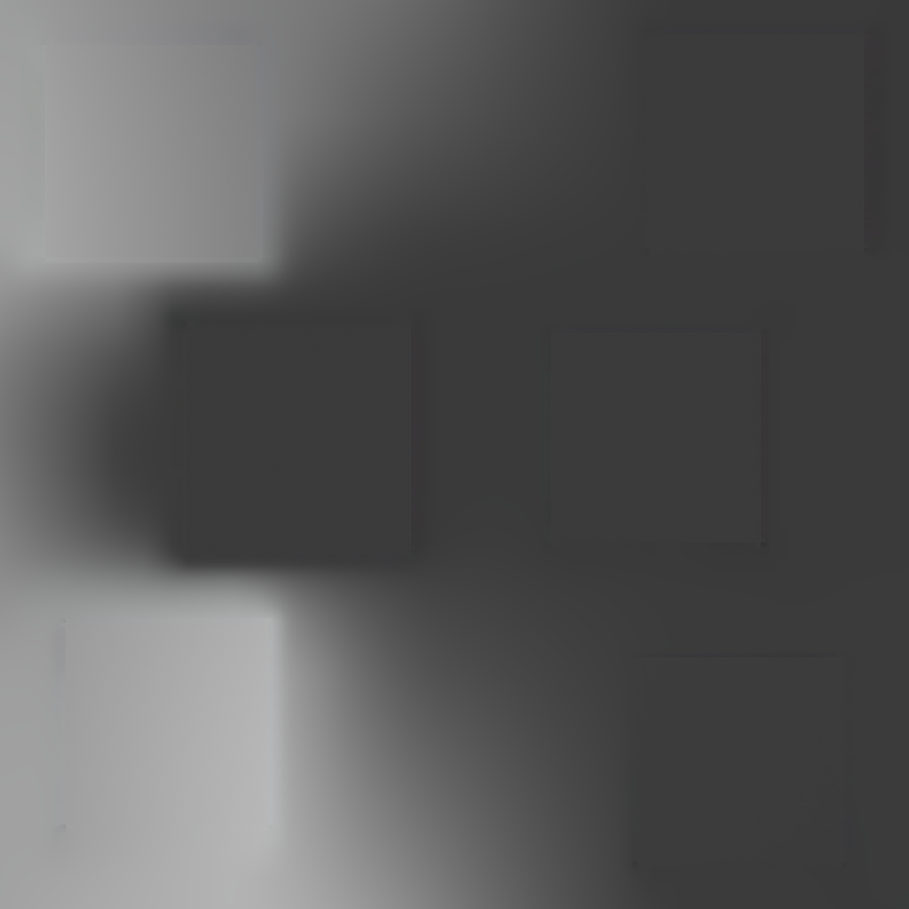
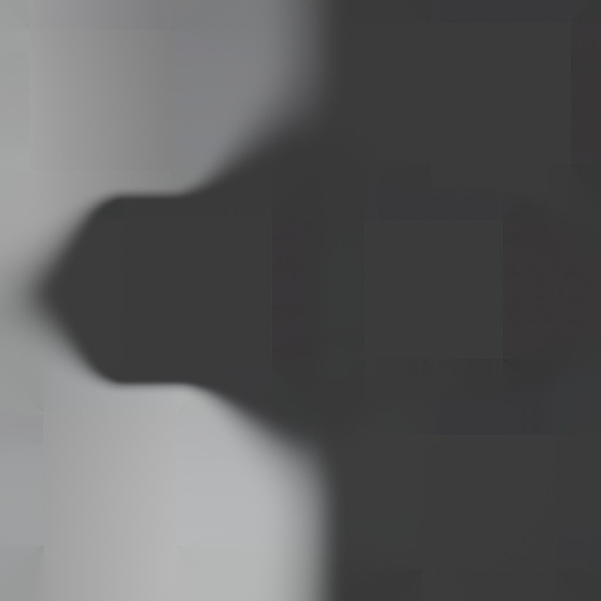
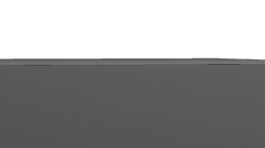

MSAA perform data interpolation between subpixels, and apply the fragment shader once on these interpolated data, such as uvs.
When using lightmaps, uvs are discontinuous at edges, since faces are packed in islands, and the interpolated uv does not correspond to any of the two connected faces.
In results, random pixels values appears on edges, sometimes with the background color of the lightmap, where no light information is stored.

I tried to find a way to fill the gap between islands with a smooth color gradient.
I know It would have some limitations.
We probably can't pack the faces in a way each of their edges is approximately facing it's corresponding other face edge, therefore some interpolated uvs won't be accurate.
Nonetheless, for some of the edges it would be so, and for the other, there is a high chance that the resulting pixel has a colour close to what we want. Lightmaps, especially grey-scaled ones, have low frequencies, and these might be improved by packing lighter faces with light ones and darker with dark ones.

I came across some inpainting algorithm ideas such as the pull-push algorithm, but fail to implement it with C++ using the CImg library.

I then take a python implementation from claude that worked. I first wanted to use in within a composition pipeline in blender, and it looks time-consuming.

I finally settled, for now, with a simple inpainting node from blender, that gives a different result, but was enough to fix my current use-cases.

 